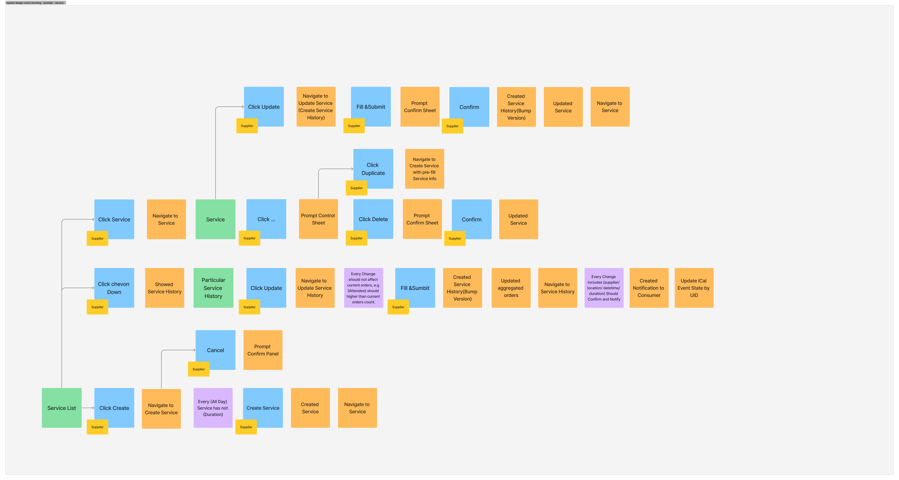

# Nano

## Goal
The main goal of this project is to create a reservation system that allows customers to reserve a service and providers to manage their services.

### Engineering goals
Using DDD to design the domain model and event sourcing to handle the business logic.
Experiencing with Clean Architecture which separating by domain folder structure.


## Design Approach
For design reference, I utilized event storming to transform wireframes into logical diagrams, facilitating top-level design creation.


### Analyzing requirements involved step-by-step wireframe design:

Example: Provider functionalities

1. Creating wireframes and user flows with input from designers.
  

2. Employing event storming to visually represent the diagram, making requirements clear for system design.
  

Utilizing the diagrams to design the database schema, thereby integrating all diagrams to provide an overview of domain separation.
  - DB Schema
    
  - Domain Separation
    
    
    


## Features (Not all features are implemented)
Provider can: 
- Create a new service
- Update a service
- Delete a service
- View all services
- View all orders
- View all orders for a specific service


Customer can:
- View all services
- Request order a service
- View all orders
- Get notified when the order with icalendar.


## Tech Stack

- Monorepo: Nx
- Frontend: React, Unocss, Vite, Jest 
- Backend: Express, TypeORM, MySQL, Docker, Jest


## Environment Setup

1. setup environment
  note: Fill in the .env file with your own credentials

    ```bash
      yarn 
      cp services/backend/.env.example services/backend/.env
    ```


2. run backend service
  note: Don't forget to setup your docker environment
    ```bash
      nx dev backend
    ```

3. run frontend service
    ```bash
      nx dev frontend
    ```

4. on your nginx to proxy the port 81 for backend and frontend service
    ```bash
      brew services start nginx
      nginx -c nginx.conf
    ```
